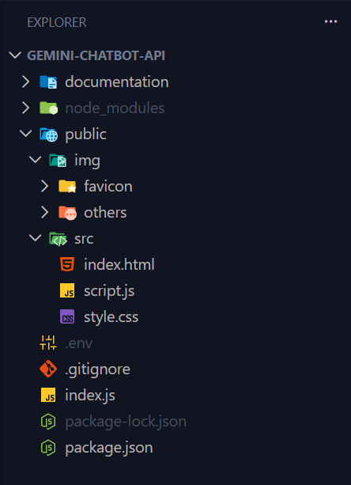
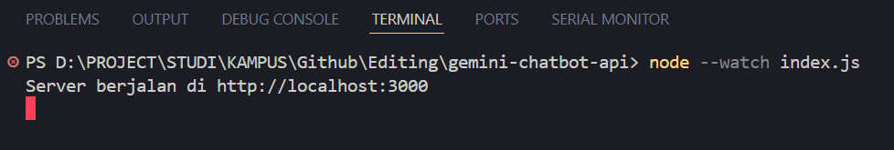
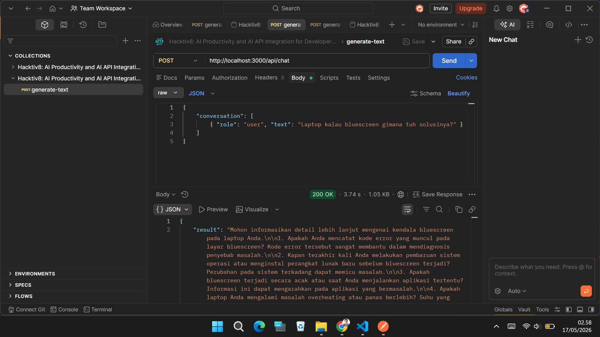
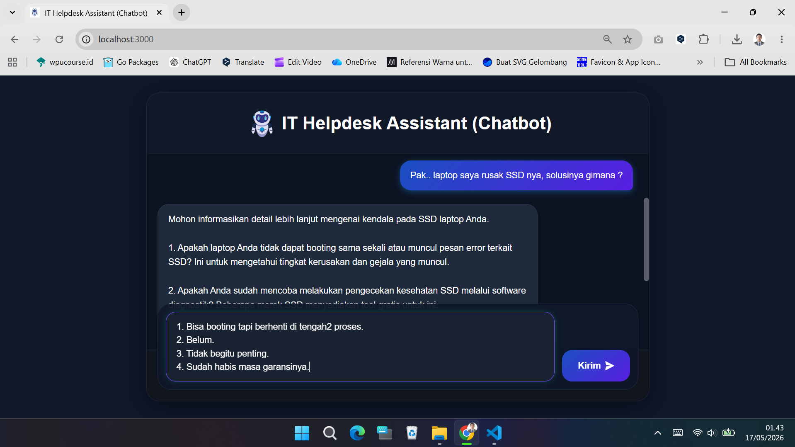
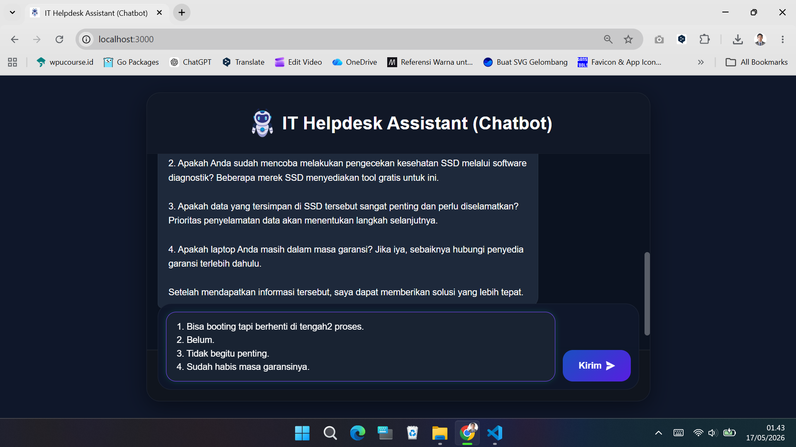
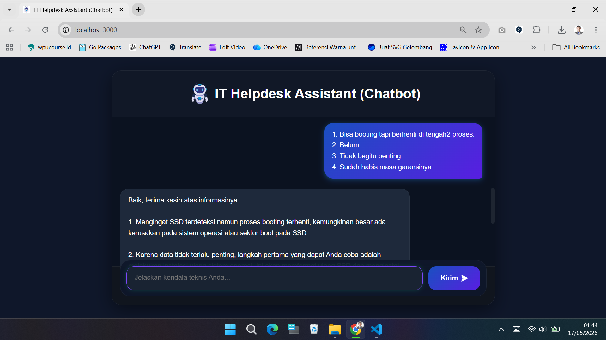
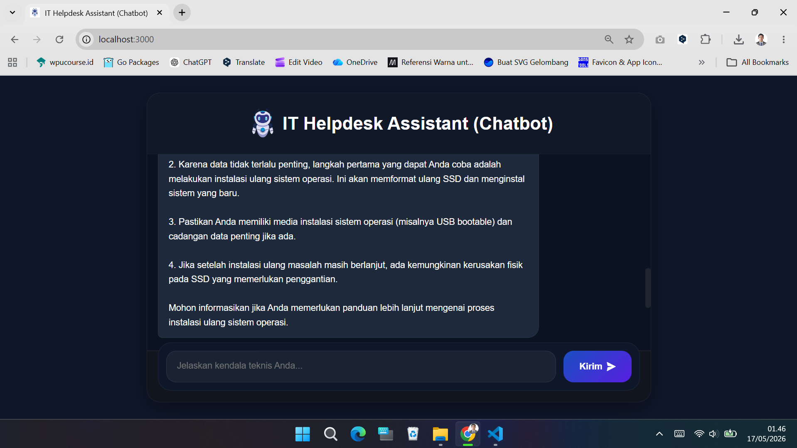
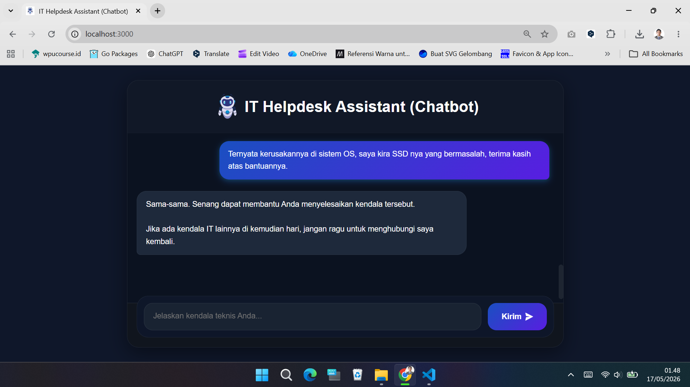
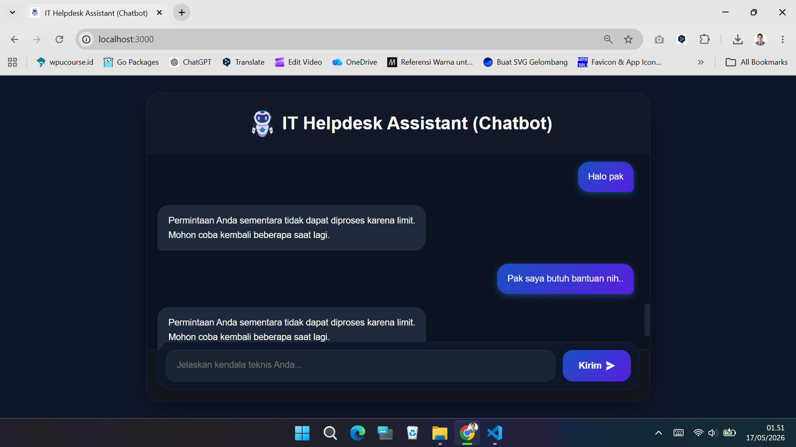

[](https://github.com/ellerbrock/open-source-badges/)


# gemini-chatbot-api
Proyek Akhir – ``` Hacktiv8: AI Productivity and AI API Integration for Developers ```

<br><br>

## 📁 Explorer: Struktur Folder dan File Proyek
<table>
<tr>
<td width="840"></td>
</tr>
</table>

<br><br>

## 🖥️ Terminal: Menjalankan Server Node.js
<table>
<tr>
<td width="840"></td>
</tr>
</table>

<br><br>

## ⚡Postman: Menguji API Endpoints
<table>
<tr>
<td width="840"></td>
</tr>
</table>

<br><br>

## 🤖 Antarmuka Bot
<table>
<tr>
<td width="280"></td>
<td width="280"></td>
<td width="280"></td>
</tr>
<tr>
<td width="280"></td>
<td width="280"></td>
<td width="280"></td>
</tr>
</table>
